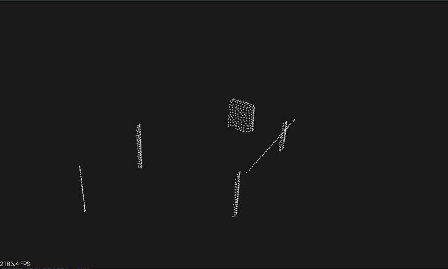
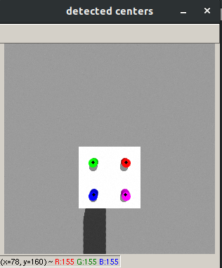

Vision based Robotic Manipulation - WPI course project

Refer my [Franka Panda](https://github.com/cdbharath/franka_panda "Franka Panda") repository for the manipulation pipeline used in this project. 

# Point cloud processing based grasp synthesis

1. Initial setup:

2. Point cloud extracted from eye in hand Kinect sensor:

3. Result of RANSAC over the point cloud:

4. Extracting only the outliers from RANSAC:

5. Point cloud of the pudding box object after passthrough filter:

6. Franka Panda grasping the object using the resulting point cloud:

# Visual servoing of a RR robot

1. Initial setup:

2. Initial camera output from the RR manipulator:

3. Camera output after the RR manipulator end effector reaches the setpoint:

4. Response of the controller:

